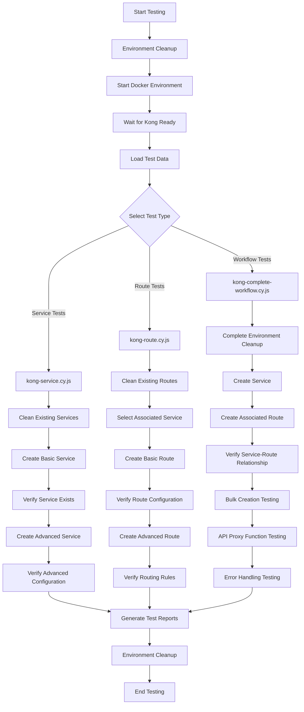

# Kong Gateway Automation Testing with Jenkins CI/CD Integration

Cypress-based Kong API Gateway automation test suite with Jenkins CI/CD pipeline integration, supporting automated Docker environment management, test report generation, and enterprise deployment.

## 🚀 Project Overview

This project provides a complete Kong Gateway automation testing solution, including:
- **Kong Gateway Automation Testing**: Cypress-based E2E testing framework
- **Jenkins CI/CD Integration**: Complete continuous integration pipeline
- **Docker Containerized Deployment**: Kong Gateway Enterprise environment
- **Intelligent Test Reporting**: Mochawesome visualization reporting system
- **Data-Driven Testing**: Flexible JSON configuration management

## 📋 Technology Stack

- **Testing Framework**: Cypress v13.6.0
- **CI/CD Platform**: Jenkins Pipeline
- **Containerization**: Docker & Docker Compose
- **API Gateway**: Kong Gateway Enterprise
- **Database**: PostgreSQL
- **Reporting System**: Mochawesome
- **Runtime Environment**: Node.js 18+

## 🛠 Prerequisites

### Development Environment
- Node.js (v18 or higher)
- Docker and Docker Compose
- Git
- npm / npx

### Jenkins Environment
- Jenkins 2.400+
- Docker access permissions
- HTML Publisher plugin
- Pipeline plugin
- NodeJS plugin (optional)

## 📦 Installation & Setup

### 1. Clone the Project
```bash
git clone https://github.com/nightwish2016/Kevin-kong-automation-testing.git
cd Kevin-kong-automation-testing
```

### 2. Install Dependencies
```bash
npm install
```

### 3. Verify Environment
```bash
docker --version
docker-compose --version
node --version
npm --version
```

## 🚀 Usage

### Complete Automated Testing (Recommended)
```bash
# Complete test workflow: Environment preparation → Test execution → Environment cleanup
npm test

# Testing with Mochawesome reports
npm run test:mochawesome

# CI environment testing (without environment management)
npm run test:ci
```

### Docker Environment Management
```bash
# Start Kong services
npm run docker:up

# Stop Kong services
npm run docker:down

# Force cleanup all containers and resources
npm run docker:cleanup

# View service logs
npm run docker:logs

# Wait for Kong services to be ready
npm run docker:wait
```

### Cypress Testing
```bash
# Interactive test runner
npm run cypress:open

# Headless mode execution (requires Kong services running)
npm run test:dev

# Run specific test files
npm run test:service:ci
```

### Test Report Management
```bash
# Clean old reports
npm run report:clean

# Merge multiple report files
npm run mochawesome:merge

# Generate HTML reports
npm run mochawesome:generate

# Open reports
npm run mochawesome:open

# Complete report workflow
npm run report:generate
```

## 📁 Project Structure

```
Kevin-kong-automation-testing/
├── cypress/                          # Cypress testing framework
│   ├── e2e/                         # E2E test files
│   │   ├── kong-service.cy.js       # Service creation tests
│   │   ├── kong-route.cy.js         # Route creation tests
│   │   └── kong-complete-workflow.cy.js # Complete workflow tests
│   ├── fixtures/                    # Test data
│   │   └── kong-data.json          # Kong configuration data
│   ├── support/                     # Support files
│   │   ├── commands.js              # Custom commands
│   │   └── e2e.js                   # Global configuration
│   └── screenshots/                 # Test screenshots
├── scripts/                         # Utility scripts
│   └── wait-for-kong.js            # Kong readiness check
├── mochawesome-report/              # Test reports (auto-generated)
├── docker-compose.yml               # Docker orchestration configuration
├── cypress.config.js                # Cypress configuration
├── Jenkinsfile                      # Jenkins pipeline configuration
└── package.json                     # Project configuration
```

## 🤖 Custom Cypress Commands

The project provides the following specialized commands:

### Navigation Commands
```javascript
cy.navigateToDefaultWorkspace()      // Navigate to default workspace
cy.waitForKongUI()                   // Wait for Kong UI to load completely
```

### Entity Management Commands
```javascript
cy.createService(serviceData)        // Create service
cy.createRoute(routeData)           // Create route
cy.cleanupKongEntities()            // Clean all entities (test prerequisites)
cy.clearAllServices()               // Clear all services
cy.clearAllRoutes()                 // Clear all routes
```

### UI Interaction Commands
```javascript
cy.handleConfirmation()             // Handle confirmation dialogs
```

## 📊 Test Data Configuration

### Kong Data Structure (`cypress/fixtures/kong-data.json`)
```json
{
  "service": {
    "name": "example-service",
    "url": "http://httpbin.org",
    "tags": ["automation", "test"]
  },
  "route": {
    "name": "example-route",
    "paths": ["/api/v1"],
    "methods": ["GET", "POST"],
    "hosts": ["api.example.com"]
  },
  "bulkServices": [...],
  "bulkRoutes": [...]
}
```

### Supported Configuration Options
- **Service Configuration**: Name, URL, tags, protocol, port
- **Route Configuration**: Paths, methods, hosts, headers
- **Bulk Operations**: Multiple service/route batch creation
- **Advanced Configuration**: Timeout, retry, load balancing

## 🏗️ Jenkins CI/CD Integration

### Pipeline Architecture

The Jenkins pipeline for this project contains the following stages:

#### 1. **Checkout Stage**
- Clean workspace
- Checkout code from specified branch
- Verify code integrity

#### 2. **Pre-test Cleanup Stage**  
- Clean up residual Docker containers
- Delete old test reports
- Ensure clean environment state

#### 3. **Setup Environment Stage**
- Install npm dependencies
- Verify Docker environment
- Check necessary tool versions

#### 4. **Run Kong Automation Tests Stage**
- Start Kong Gateway containers
- Wait for services to be ready
- Execute automation tests
- Collect test results

#### 5. **Generate Test Reports Stage**
- Merge Mochawesome reports
- Generate HTML test reports
- Process test artifacts

#### 6. **Archive Results Stage**
- Archive test reports
- Save Docker logs
- Store screenshots and videos

### Pipeline Parameters

| Parameter | Type | Default Value | Description |
|-----------|------|---------------|-------------|
| `GIT_URL` | String | `git@github.com:nightwish2016/kevin-kong-automation-testing.git` | Git repository address |
| `GIT_BRANCH` | String | `main` | Target branch |
| `ENVIRONMENT` | Choice | `dev` | Test environment (dev/staging/production) |
| `CLEANUP_AFTER_TEST` | Boolean | `true` | Whether to clean containers after testing |

### Environment Variable Configuration

```groovy
environment {
    NODE_VERSION = '18'                    // Node.js version
    DOCKER_BUILDKIT = '1'                  // Docker BuildKit
    COMPOSE_DOCKER_CLI_BUILD = '1'         // Docker Compose CLI
}
```

### Error Handling Strategy

The pipeline includes comprehensive error handling mechanisms:

1. **Test Failure Handling**: Mark build as UNSTABLE rather than FAILURE
2. **Container Cleanup**: Ensure Docker resources are cleaned regardless of success/failure
3. **Log Collection**: Automatically collect Docker and application logs
4. **Artifact Preservation**: Save screenshots and debug information on failure

### Report Publishing

Automatically publishes the following reports:
- **HTML Test Reports**: Mochawesome interactive reports
- **Docker Logs**: Container runtime logs
- **Test Screenshots**: Screenshots of failed test cases
- **Test Videos**: Complete execution recordings (if enabled)

## 🔧 Docker Environment Configuration

### Service Architecture

The project uses Docker Compose to manage the following services:

#### PostgreSQL Database
```yaml
kong-ee-database:
  image: postgres
  container_name: kong-ee-database
  environment:
    POSTGRES_USER: kong
    POSTGRES_DB: kong
    POSTGRES_PASSWORD: kong
  ports:
    - "5432:5432"
  healthcheck:
    test: ["CMD", "pg_isready", "-U", "kong"]
    interval: 5s
    timeout: 10s
    retries: 10
```

#### Kong Gateway Control Plane
```yaml
kong-cp:
  image: kong/kong-gateway
  container_name: kong-cp
  command: sh -c "kong migrations bootstrap && kong start"
  environment:
    KONG_DATABASE: postgres
    KONG_PG_HOST: kong-ee-database
    KONG_ADMIN_GUI_URL: http://localhost:8002
    KONG_ADMIN_LISTEN: 0.0.0.0:8001, 0.0.0.0:8444 ssl
    KONG_PROXY_LISTEN: 0.0.0.0:8000, 0.0.0.0:8443 ssl
  ports:
    - "8000:8000"  # Proxy HTTP
    - "8001:8001"  # Admin API HTTP
    - "8002:8002"  # Admin GUI HTTP
    - "8443:8443"  # Proxy HTTPS
    - "8444:8444"  # Admin API HTTPS
```

### Network Configuration
```yaml
networks:
  kong-ee-net:
    driver: bridge
```

### Data Persistence
```yaml
volumes:
  kong_db_data: {}
```

## 🧪 Test Cases Detailed

### Test Architecture Design

This project adopts a layered testing architecture, containing three core test files, each focusing on specific functional domains:

#### 1. **Service Creation Tests (kong-service.cy.js)**

Tests focus on Kong Gateway Service entity creation and management:

**Test Case Coverage**:
- ✅ **Basic Service Creation**: Verify minimal configuration service creation workflow
- ✅ **Advanced Service Creation**: Include timeout, retry and other advanced configuration options
- ✅ **Data-Driven Testing**: Use test data from `kong-data.json`
- ✅ **UI Element Adaptation**: Intelligently identify different versions of Kong UI elements

**Core Test Logic**:
```javascript
// Test prerequisites: Clean all existing Services and Routes
before(() => {
  cy.cleanupKongEntities()  // Ensure clean test environment
})

// Test steps:
1. Navigate to default workspace → Services page
2. Click "New Gateway Service" button (using flexible selectors)
3. Fill in service basic information (name, URL, tags)
4. Optional: Configure advanced options (retry count, timeout settings)
5. Submit form and verify service creation success
6. Verify service appears in service list
```

**Error-Tolerant Design**:
- Multiple UI element selectors: Adapt to interface changes in different Kong versions
- Dynamic element detection: Intelligently determine if advanced options area exists
- Form validation handling: Handle required fields and data format validation

#### 2. **Route Creation Tests (kong-route.cy.js)**

Focuses on Kong Gateway Route entity creation, including service association configuration:

**Test Case Coverage**:
- ✅ **Basic Route Creation**: Path, method, host configuration
- ✅ **Advanced Route Configuration**: Strip Path, Preserve Host and other options
- ✅ **Service Association Testing**: Route binding relationships with existing services
- ✅ **Multiple HTTP Method Support**: GET, POST, PUT, DELETE and other method configurations

**Core Test Logic**:
```javascript
// Test prerequisites: Only clear routes, keep services for association
before(() => {
  cy.clearAllRoutes()  // Keep existing services, only clear routes
})

// Test steps:
1. Navigate to Routes page, click "New Route"
2. Configure route basic information:
   - Route name: test-route
   - Associated service: Through dropdown selection or input matching
   - Request path: /api/v1/login
   - HTTP methods: GET, POST (multi-select support)
3. Configure advanced options:
   - Strip Path: Control path forwarding behavior
   - Preserve Host: Maintain original host headers
   - Tag management: For route classification
4. Submit and verify route creation
```

**Intelligent Service Association**:
```javascript
// Multiple service selection strategies
if (route.service) {
  // 1. Try dedicated route-form-service-id input box
  if (cy.get('input[data-testid="route-form-service-id"]').length > 0) {
    // Open dropdown menu, search for matching service
  }
  // 2. Try generic service selection box
  else if (cy.get('input[placeholder*="Select a service"]').length > 0) {
    // Identify service selector through placeholder text
  }
  // 3. Try dropdown component
  else if (cy.get('.dropdown, [role="combobox"]').length > 0) {
    // Handle standard dropdown component
  }
}
```

#### 3. **Complete Workflow Tests (kong-complete-workflow.cy.js)**

Integration test file, verifying end-to-end service and route creation workflow and actual API calls:

**Test Case Coverage**:
- ✅ **Complete Service+Route Workflow**: Complete workflow from service creation to route configuration
- ✅ **Bulk Entity Creation**: Bulk creation testing of multiple services and routes
- ✅ **Error Handling Verification**: Handling of error scenarios like invalid URLs
- ✅ **API Endpoint Verification**: Call actual backend services through Kong proxy

**End-to-End Test Logic**:
```javascript
it('Complete full service and route creation workflow', () => {
  cy.fixture('kong-data').then((data) => {
    // Step 1: Create service
    cy.createService(data.service)
    cy.contains(data.service.name).should('be.visible')
    
    // Step 2: Create route for service
    cy.createRoute({
      ...data.route,
      service: data.service.name  // Associate with just created service
    })
    
    // Step 3: Verify service-route relationship
    cy.contains(data.route.name).click()
    cy.contains(data.service.name).should('be.visible')
  })
})
```

**API Proxy Testing**:
```javascript
it('Create login service and route then call API endpoint', () => {
  // 1. Create service pointing to real backend
  const loginService = {
    name: 'login-service',
    url: 'http://104.168.218.218:5000'  // Real login API
  }
  
  // 2. Create route mapping
  const loginRoute = {
    name: 'login-route',
    paths: ['/api/v1/login'],
    methods: ['POST']
  }
  
  // 3. Call API through Kong proxy
  cy.request({
    method: 'POST',
    url: 'http://localhost:8000/api/v1/login',  // Kong proxy address
    body: { email: 'kzhou2017@outlook.com', password: '123' }
  }).then((response) => {
    // Verify request processed through Kong
    expect(response.headers.via).to.contain('kong')
    // Verify business logic response
    expect(response.body.UserName).to.equal('kevin')
  })
})
```

### Test Data-Driven Architecture

**Data Separation Principle**:
All test data is centralized in `cypress/fixtures/kong-data.json`, achieving separation of test logic and data:

```json
{
  "service": {                    // Basic service configuration
    "name": "kevin-test-service",
    "url": "http://104.168.218.218:5000",
    "tags": ["test", "automation"]
  },
  "advancedService": {            // Advanced service configuration
    "name": "kevin-advanced-test-service",
    "retries": 5,
    "connect_timeout": 60000,
    "read_timeout": 60000,
    "write_timeout": 60000
  },
  "testData": {                   // Bulk test data
    "services": [...],            // Multiple service configuration array
    "routes": [...]               // Multiple route configuration array
  }
}
```

### Error-Tolerant and Adaptive Design

**Flexible UI Element Selection**:
Each test implements multi-level element selection strategies:

```javascript
// Button selection priority strategy
cy.get('body').then(($body) => {
  if ($body.find('[data-testid="empty-state-action"]').length > 0) {
    // 1. Prefer data-testid attribute (most stable)
    cy.get('[data-testid="empty-state-action"]').click()
  } else if ($body.find('button:contains("New gateway service")').length > 0) {
    // 2. Through button text matching
    cy.contains('New gateway service').click()
  } else {
    // 3. Generic fallback selector
    cy.get('button:contains("New"), button:contains("Add")').first().click()
  }
})
```

**Form Field Adaptability**:
```javascript
// Multiple input box matching strategies
cy.get('body').then(($body) => {
  if ($body.find('input[name="name"]').length > 0) {
    // 1. Standard name attribute matching
    cy.get('input[name="name"]').type(serviceName)
  } else if ($body.find('input[placeholder*="name"]').length > 0) {
    // 2. Placeholder text matching
    cy.get('input[placeholder*="name"]').first().type(serviceName)
  } else {
    // 3. Log field not found but continue test
    cy.log('Name field not found, continuing without setting name')
  }
})
```

### Custom Command Architecture

The project implements a suite of dedicated Cypress custom commands, encapsulating Kong-specific operational logic:

**Entity Management Commands**:
- `cy.createService(serviceData)` - Intelligent service creation, handling all UI variants
- `cy.createRoute(routeData)` - Route creation, including service association logic
- `cy.cleanupKongEntities()` - Complete environment cleanup
- `cy.clearAllServices()` / `cy.clearAllRoutes()` - Selective cleanup

**Navigation and Waiting Commands**:
- `cy.navigateToDefaultWorkspace()` - Standardized workspace navigation
- `cy.waitForKongUI()` - Wait for Kong UI to complete loading
- `cy.handleConfirmation()` - Confirmation dialog handling

### Error Handling and Validation Strategy

**Client-side Validation Testing**:
```javascript
it('Handle service creation errors gracefully', () => {
  // Input invalid URL format
  cy.get('input[name="url"]').type('invalid-url')
  
  // Verify client validation error message
  cy.get('body').should('contain.text', 
    'The URL must follow a valid format. Example: https://api.kong-air.com/flights')
  
  // Verify submit button is disabled
  cy.get('button[type="submit"]').should('be.disabled')
})
```

**Network-level Validation**:
```javascript
// API proxy functionality verification
cy.request({
  method: 'POST',
  url: 'http://localhost:8000/api/v1/login',
  failOnStatusCode: false  // Allow non-2xx responses for error scenario testing
}).then((response) => {
  // Verify request processed through Kong
  expect(response.headers).to.have.property('via')
  expect(response.headers.via).to.contain('kong')
})
```

### Test Execution Strategy

**Environment Cleanup Strategy**:
The project adopts layered cleanup strategy to ensure test isolation:

```javascript
// Complete cleanup - for test suite start
before(() => {
  cy.cleanupKongEntities()  // Clean all Services and Routes
})

// Partial cleanup - for specific test scenarios
before(() => {
  cy.clearAllRoutes()       // Only clean Routes, keep Services
})

// Smart cleanup - dynamic cleanup based on test needs
beforeEach(() => {
  cy.visit('/workspaces')
  cy.waitForKongUI()        // Ensure UI fully loaded
})
```

**Concurrency and Dependency Management**:
```javascript
// Bulk creation test - demonstrate concurrent entity management
it('Create multiple services and routes', () => {
  // Serial service creation (avoid name conflicts)
  data.testData.services.forEach((service, index) => {
    cy.createService(service)
    
    // Create corresponding route for each service
    const route = data.testData.routes[index]
    if (route) {
      cy.createRoute({
        ...route,
        service: service.name  // Ensure route associates with correct service
      })
    }
  })
})
```

**Test Data Validation Process**:
1. **Prerequisite Verification**: Ensure Kong services are available
2. **Creation Verification**: Verify entity creation success
3. **Function Verification**: Verify configuration items take effect
4. **Integration Verification**: Verify end-to-end functionality
5. **Cleanup Verification**: Ensure test environment restoration

### Test Environment Management

**Docker Environment Synchronization**:
Test execution is tightly integrated with Docker environment:

```bash
# Complete test workflow (recommended)
npm test                    # Environment preparation → Test execution → Environment cleanup

# Detailed step explanation:
1. npm run docker:cleanup   # Clean residual containers
2. npm run docker:up        # Start Kong + PostgreSQL
3. npm run docker:wait      # Wait for services ready (health check)
4. npm run test:ci          # Execute test suite
5. npm run docker:down      # Clean environment resources
```

**Environment Health Check**:
```javascript
// scripts/wait-for-kong.js implementation logic
const waitForKong = async () => {
  const maxRetries = 30
  let retries = 0
  
  while (retries < maxRetries) {
    try {
      // Check Kong Admin API
      const adminResponse = await fetch('http://localhost:8001/status')
      if (adminResponse.ok) {
        // Check Kong Manager UI
        const uiResponse = await fetch('http://localhost:8002')
        if (uiResponse.ok) {
          console.log('Kong services are ready!')
          return true
        }
      }
    } catch (error) {
      console.log(`Waiting for Kong... (${retries + 1}/${maxRetries})`)
    }
    
    await sleep(2000)  // Wait 2 seconds before retry
    retries++
  }
  
  throw new Error('Kong failed to start within timeout period')
}
```

### Test Data Lifecycle Management

**Dynamic Test Data Generation**:
```javascript
// Timestamp strategy to avoid data conflicts
const generateUniqueService = (baseConfig) => ({
  ...baseConfig,
  name: `${baseConfig.name}-${Date.now()}`,  // Timestamp ensures uniqueness
  tags: [...baseConfig.tags, `run-${Date.now()}`]
})

// Real backend service integration
const realWorldServices = [
  {
    name: 'login-service',
    url: 'http://104.168.218.218:5000',  // Real login API
    endpoints: ['/api/v1/login']
  },
  {
    name: 'httpbin-service',
    url: 'http://httpbin.org',           // HTTP test service
    endpoints: ['/anything', '/get', '/post']
  }
]
```

**Test Data Validation**:
```javascript
// Data integrity validation
cy.fixture('kong-data').then((data) => {
  // Verify required fields exist
  expect(data.service).to.have.property('name')
  expect(data.service).to.have.property('url')
  
  // Verify URL format
  expect(data.service.url).to.match(/^https?:\/\//)
  
  // Verify service-route association relationship
  expect(data.route.service).to.equal(data.service.name)
})
```

### Test Case Execution Flowchart



### Testing Best Practices

**1. Idempotent Design**:
Each test should be able to run independently, not depending on other tests' state:

```javascript
// ✅ Good practice - each test cleans independently
beforeEach(() => {
  cy.cleanupKongEntities()  // Ensure clean starting state
})

// ❌ Avoid - depending on previous test results
it('should create route for existing service', () => {
  // Assuming previous test already created service - this is wrong
})
```

**2. Data-Driven Testing**:
Use external data files for easier maintenance and extension:

```javascript
// ✅ Data-driven approach
cy.fixture('kong-data').then((data) => {
  data.testData.services.forEach((service) => {
    it(`should create service: ${service.name}`, () => {
      cy.createService(service)
      cy.contains(service.name).should('be.visible')
    })
  })
})

// ❌ Hard-coded data
it('should create specific service', () => {
  cy.createService({
    name: 'hardcoded-service',  // Hard to maintain
    url: 'http://example.com'
  })
})
```

**3. Smart Waiting Strategy**:
Use conditional waiting instead of fixed delays:

```javascript
// ✅ Smart waiting
cy.get('[data-testid="service-list"]')
  .should('be.visible')
  .and('not.contain', 'Loading...')

// ❌ Fixed delay
cy.wait(5000)  // May be too long or too short
```

**4. Error Recovery Mechanism**:
Implement environment recovery after test failures:

```javascript
// Global error handling
Cypress.on('uncaught:exception', (err, runnable) => {
  // Handle known Kong UI errors
  if (err.message.includes('Kong Gateway')) {
    return false  // Prevent test failure
  }
  return true
})

// Test-level recovery
afterEach(function() {
  if (this.currentTest.state === 'failed') {
    cy.screenshot(`failed-${this.currentTest.title}`)
    cy.cleanupKongEntities()  // Clean environment after failure
  }
})
```

**5. Performance Optimization Strategy**:
```javascript
// Execute applicable operations in parallel
cy.createService(service1)
cy.createService(service2)  // Don't wait for first to complete

// Batch validation
const serviceNames = ['service-1', 'service-2', 'service-3']
serviceNames.forEach(name => {
  cy.contains(name).should('be.visible')
})
```

### Test Debugging Tips

**1. Interactive Debugging**:
```bash
# Open Cypress test runner for debugging
npm run cypress:open

# Use cy.pause() in tests to pause execution
cy.pause()  // Allow manual inspection of current state
```

**2. Logging and Screenshots**:
```javascript
// Detailed logging
cy.log(`Creating service: ${service.name}`)
cy.log(`Service URL: ${service.url}`)

// Key step screenshots
cy.screenshot('before-service-creation')
cy.createService(service)
cy.screenshot('after-service-creation')
```

**3. Selector Debugging**:
```javascript
// Debug element selectors
cy.get('body').then(($body) => {
  console.log('Available buttons:', $body.find('button').toArray())
  console.log('Form inputs:', $body.find('input').toArray())
})
```

## 📊 Test Reporting System

### Mochawesome Integration

The project integrates Mochawesome reporting system, providing:

- **Interactive HTML Reports**: Detailed test result display
- **Execution Statistics**: Pass rate, failure rate, execution time
- **Error Details**: Detailed error information for failed test cases
- **Screenshot Integration**: Automatic screenshots on failure
- **Historical Trends**: Comparison of multiple execution results

### Report Structure

```
mochawesome-report/
├── mochawesome*.json              # Raw report data
├── merged-report.json             # Merged report data
└── mochawesome-report/            # HTML reports
    ├── merged-report.html         # Main report file
    └── assets/                    # Static resources
```

### Jenkins Report Integration

Jenkins automatically publishes reports:
- **Report Name**: Kong Automation Test Report
- **Access Path**: Build Details → Kong Automation Test Report
- **Features**: Support historical versions, direct links, complete styling

## 🚨 Troubleshooting

### Common Issues and Solutions

#### 1. Docker Permission Errors
```bash
# Linux Systems
sudo usermod -aG docker jenkins
sudo systemctl restart jenkins

# Windows Systems
# Ensure Docker Desktop is running and accessible to Jenkins user
```

#### 2. Port Conflicts
```bash
# Check port usage
netstat -tlnp | grep :8002    # Linux
netstat -an | findstr :8002   # Windows

# Clean containers
npm run docker:cleanup
```

#### 3. Memory Issues
```javascript
// cypress.config.js
module.exports = {
  env: {
    NODE_OPTIONS: '--max-old-space-size=4096'
  }
}
```

#### 4. Kong Startup Timeout
```bash
# Increase wait time
# Adjust timeout parameters in scripts/wait-for-kong.js

# Check Kong logs
npm run docker:logs
```

#### 5. Test Data Conflicts
```javascript
// Use cleanup commands before tests
beforeEach(() => {
  cy.cleanupKongEntities()
})
```

### Debugging Tips

#### 1. Local Debugging
```bash
# Start Kong environment
npm run docker:up
npm run docker:wait

# Open Cypress debugging interface
npm run cypress:open

# View Kong Admin UI
# http://localhost:8002
```

#### 2. Jenkins Debugging
```bash
# View build logs
# Jenkins → Build History → Console Output

# Check report artifacts
# Jenkins → Build Details → Artifacts

# View Docker logs
# Find docker-logs.txt in build artifacts
```

#### 3. Container Debugging
```bash
# Enter Kong container
docker exec -it kong-cp /bin/bash

# View Kong configuration
kong config

# Check database connection
docker exec -it kong-ee-database psql -U kong -d kong
```

## 
